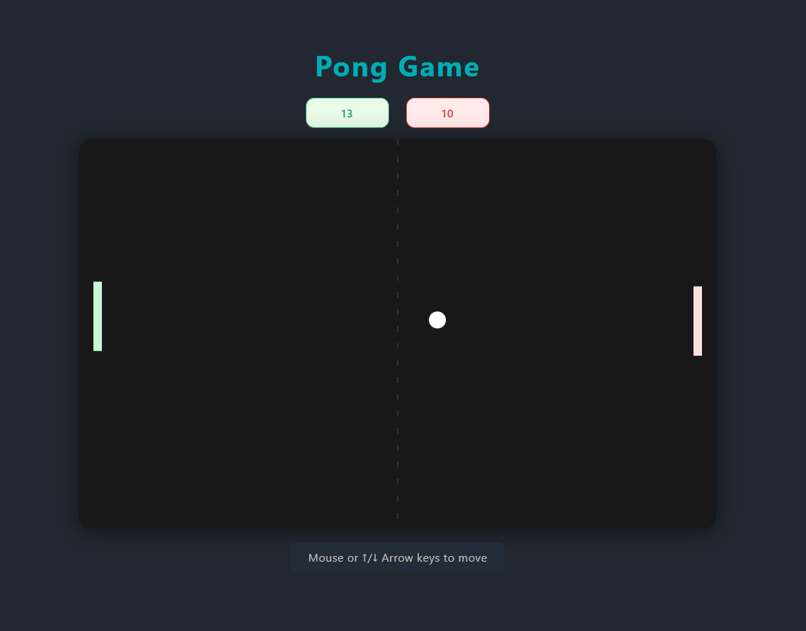

# 🏓 Pong Game

A classic Pong game implementation using HTML5 Canvas and JavaScript. Experience the timeless arcade game with smooth gameplay, responsive controls, and modern styling.

## 🎮 Game Features

- **Classic Pong Gameplay**: Traditional two-paddle ball bouncing mechanics
- **Smart AI Opponent**: Computer-controlled paddle with smooth movement
- **Dual Control Options**: Play with mouse or keyboard arrow keys
- **Score Tracking**: Real-time success and error counter
- **Responsive Design**: Clean, modern interface with smooth animations
- **Browser-Based**: No installation required - play directly in your web browser

## 🎯 How to Play

1. **Player Controls**: Use your mouse to move the left paddle up and down, or use the ↑/↓ arrow keys
2. **Objective**: Prevent the ball from passing your paddle while trying to get it past the computer's paddle
3. **Scoring**:
   - Green counter increases when you successfully return the ball
   - Red counter increases when you miss the ball

## 📸 Screenshots



## 🚀 Getting Started

### Prerequisites

- Any modern web browser (Chrome, Firefox, Safari, Edge)
- No additional software installation required

### Installation & Setup

1. **Clone the repository**:

   ```bash
   git clone https://github.com/yourusername/PongGame.git
   ```

2. **Navigate to the project directory**:

   ```bash
   cd PongGame
   ```

3. **Open the game**:

   - Simply open `index.html` in your web browser
   - Or use a local server for the best experience:

     ```bash
     # Using Python
     python -m http.server 8000

     # Using Node.js
     npx http-server
     ```

4. **Start Playing**:
   - Navigate to `http://localhost:8000` (if using a local server)
   - Or directly open the `index.html` file in your browser

## 📁 Project Structure

```
PongGame/
├── index.html          # Main HTML file
├── readme.md          # Project documentation
├── css/
│   └── style.css      # Game styling and layout
├── js/
│   └── script.js      # Game logic and mechanics
├── docs/
│   └── contribution.md # Contribution guidelines
└── screenshorts/
    └── screenshort01.png # Game screenshot
```

## 🎨 Game Mechanics

- **Ball Physics**: Realistic ball movement with collision detection
- **Paddle Movement**: Smooth player-controlled paddle with boundary constraints
- **AI Behavior**: Computer paddle follows the ball with easing for natural movement
- **Collision System**: Accurate ball-paddle collision detection and response
- **Score System**: Real-time tracking of successful hits and misses

## 🛠️ Technologies Used

- **HTML5 Canvas**: For game rendering and graphics
- **JavaScript (ES6+)**: Game logic and interactivity
- **CSS3**: Modern styling and responsive design
- **Web APIs**: Mouse and keyboard event handling

## 🎯 Game Controls

| Control        | Action                     |
| -------------- | -------------------------- |
| Mouse Movement | Move player paddle up/down |
| ↑ Arrow Key    | Move player paddle up      |
| ↓ Arrow Key    | Move player paddle down    |

## 🔧 Customization

You can easily customize the game by modifying the constants in `js/script.js`:

```javascript
const PADDLE_SPEED = 7; // Paddle movement speed
const BALL_RADIUS = 12; // Ball size
const COMPUTER_EASE = 0.11; // AI difficulty (lower = harder)
```

## 🤝 Contributing

We welcome contributions to improve the Pong Game! Please read our [Contribution Guidelines](docs/contribution.md) for details on how to contribute to this project.

## 📄 License

This project is open source and available under the [MIT License](LICENSE).

## 🎉 Acknowledgments

- Inspired by the classic Pong arcade game by Atari
- Built with modern web technologies for smooth gameplay
- Designed with accessibility and user experience in mind

## 📞 Support

If you encounter any issues or have questions:

- Open an issue on GitHub
- Check the [Contribution Guidelines](docs/contribution.md) for common solutions
- Contact us directly: [hello@toufikforyou.dev](mailto:hello@toufikforyou.dev)

---

**Enjoy playing Pong! 🏓**
